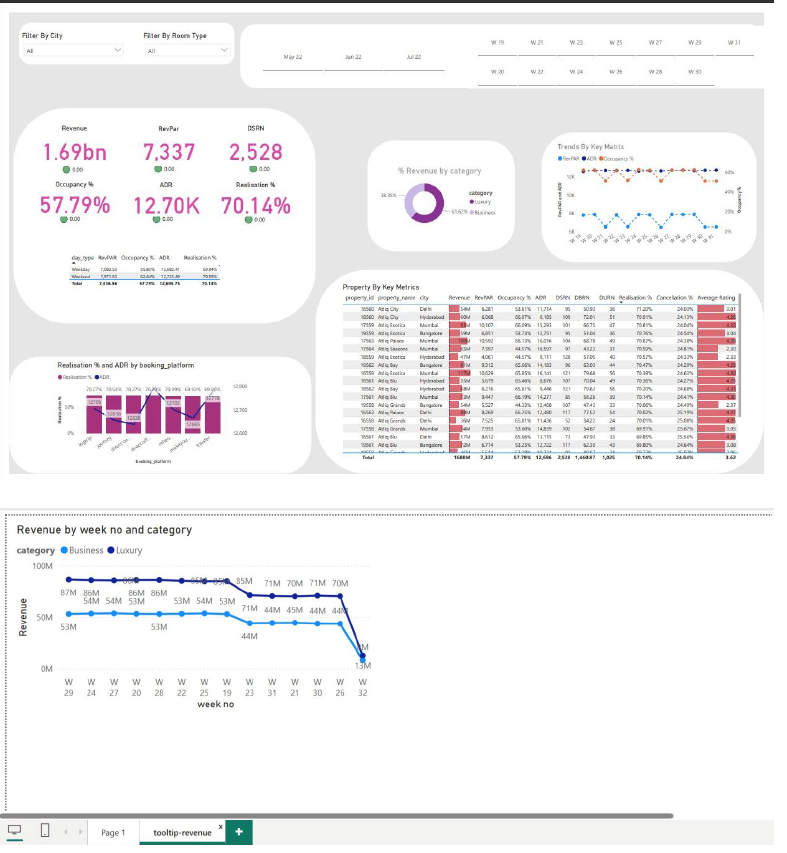

# Hotel Management Business Intelligence Dashboard

## Overview

This project is an end-to-end Business Intelligence solution developed using Power BI to analyze hotel performance and support data-driven decision-making in the hospitality industry.

The project focuses on transforming raw hotel management data into meaningful insights through data modeling, DAX calculations, interactive visualizations, and dashboard reporting.

## Business Problem

Hotel managers require timely insights into occupancy trends, revenue performance, booking patterns, and operational efficiency to make informed decisions.

This dashboard provides a centralized view of key hotel metrics, enabling stakeholders to monitor performance, identify trends, and improve business outcomes.

## Objectives

- Understand hotel business operations and reporting requirements.
- Load and transform hotel datasets.
- Design a star schema data model.
- Create DAX measures and calculated columns.
- Build interactive dashboards for business analysis.
- Publish insights through Power BI Service.
- Showcase the project as part of a data analytics portfolio.

## Tools & Technologies

- Power BI Desktop
- Power Query
- DAX (Data Analysis Expressions)
- Data Modeling
- Power BI Service

## Dataset

The project uses hotel management datasets consisting of fact and dimension tables, including:

- Fact Bookings
- Fact Aggregated Bookings
- Dim Date
- Dim Rooms
- Dim Hotels

## Data Preparation

The following data preparation tasks were completed:

- Imported datasets into Power BI.
- Cleaned and transformed data using Power Query.
- Handled missing and inconsistent values.
- Standardized data formats.
- Created relationships between fact and dimension tables.

## Data Modeling

A Star Schema data model was implemented to improve analytical performance and maintainability.

### Tables

#### Fact Tables
- Fact Bookings
- Fact Aggregated Bookings

#### Dimension Tables
- Dim Date
- Dim Rooms
- Dim Hotels

### Relationships
Relationships were established between fact and dimension tables to enable efficient filtering and reporting.

## DAX Measures

Several DAX measures were created to support business analysis, including:

- Total Revenue
- Total Bookings
- Occupancy Rate
- Average Daily Rate (ADR)
- Revenue per Available Room (RevPAR)
- Booking Trends
- Cancellation Rate

## Dashboard Features

The dashboard provides interactive visualizations including:

- Revenue Analysis
- Booking Trends
- Occupancy Performance
- Hotel Comparison
- Room Category Analysis
- Key Performance Indicators (KPIs)
- Date-Based Filtering

## Key Insights

The dashboard enables stakeholders to:

- Monitor hotel revenue performance.
- Analyze occupancy trends over time.
- Compare hotel performance across locations.
- Identify high-performing room categories.
- Track booking and cancellation patterns.
- Support strategic business decisions.

## Dashboard Preview

### Executive Dashboard

## Results

This project demonstrates the complete Business Intelligence workflow:

- Data Loading
- Data Cleaning
- Data Transformation
- Data Modeling
- DAX Development
- Dashboard Design
- Business Insight Generation
