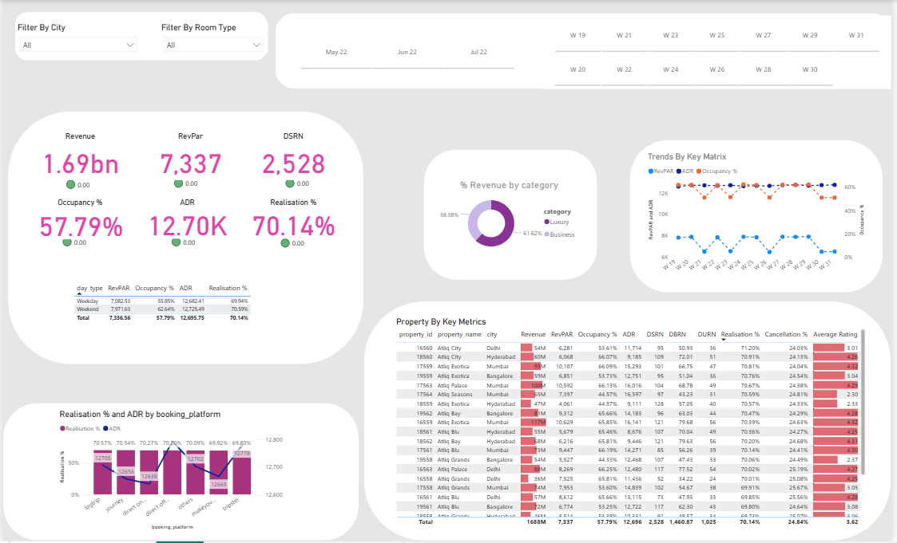

# Hotel Management Business Intelligence Dashboard | PowerBI

A Business Intelligence project developed using Microsoft Power BI to analyze hotel performance, occupancy trends, revenue metrics, and booking patterns. This project demonstrates the complete BI workflow from data preparation and modeling to DAX calculations and dashboard visualization.

## Project Overview

This project was completed as part of the Data and Artificial Intelligence track in the Cyber Shujaa Program. The objective was to simulate a real-world Business Intelligence project within the hotel management domain and develop a dashboard that supports data-driven decision-making.

The project follows an end-to-end data analyst workflow, including business understanding, data transformation, data modeling, DAX calculations, and dashboard development.

## Business Problem

Hotel managers require accurate and timely insights into operational performance to improve decision-making. Key areas of interest include:

- Occupancy rates
- Revenue performance
- Booking trends
- Room category performance
- Average Daily Rate (ADR)
- Revenue per Available Room (RevPAR)

This dashboard provides a centralized view of these metrics to support strategic and operational planning.

## Objectives

- Understand hotel business requirements and key performance indicators.
- Load and transform multiple datasets in Power BI.
- Build a star-schema data model.
- Create calculated columns and measures using DAX.
- Develop an interactive dashboard for business users.
- Present actionable insights through data visualization.

## Tools and Technologies

- Microsoft Power BI
- Power Query
- DAX (Data Analysis Expressions)
- Data Modeling
- Business Intelligence

## Project Workflow

### Business Understanding

The project began by identifying key hotel performance metrics that are commonly used by management teams, including occupancy percentage, revenue, ADR, RevPAR, booking trends, and room performance.

### Data Loading and Transformation

Several datasets were imported into Power BI, including booking records and supporting dimension tables such as:

- Dim Date
- Dim Rooms
- Additional supporting tables

Data transformation activities included:

- Removing duplicate records
- Handling missing values
- Correcting data types
- Renaming columns
- Creating derived fields
- Preparing data for analysis

### Data Modeling

A star schema architecture was implemented to optimize analytical performance.

The central fact table containing booking and revenue information was linked to dimension tables through one-to-many relationships, enabling accurate filtering and aggregation throughout the dashboard.

### DAX Measures

Several DAX measures were created to support business analysis, including:

- Total Bookings
- Occupancy %
- Average Daily Rate (ADR)
- Revenue per Available Room (RevPAR)
- Revenue Metrics
- Booking Performance Indicators

The measures were designed using clear naming conventions to improve readability and maintainability.

### Dashboard Development

An interactive Power BI dashboard was developed featuring:

- KPI Cards
- Revenue Analysis
- Occupancy Tracking
- Booking Trend Analysis
- Room Performance Insights
- Interactive Filters and Slicers
- Date-Based Analysis

The dashboard was designed with a focus on usability, clarity, and business relevance.

## Key Skills Demonstrated

- Business Intelligence
- Data Cleaning and Transformation
- Data Modeling
- Star Schema Design
- DAX Development
- Data Visualization
- Dashboard Design
- Analytical Thinking

## Dashboard Preview

Add screenshots of your dashboard here.

### Main Dashboard

## Project Report

A detailed report describing the project workflow and methodology is included in this repository.
